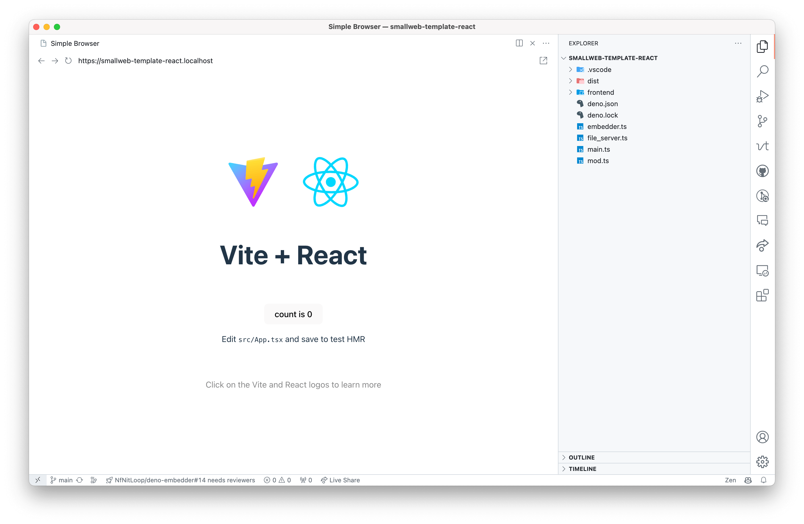

# Smallweb React Template

## Usage

1. Install smallweb
1. Clone the repository `git clone https://github.com/pomdtr/smallweb-react-template ~/www/smallweb-react-template`
1. Go to <https://smallweb-react-template.localhost> and see your app running.

## Development

- Use `deno task install-frontend-deps` to install frontend dependencies.
- Use `deno task build` to build the frontend, then embed it in the app.

## Distribution

- Update the name field in the `deno.json` file.
- Run `deno publish` to publish the to the JSR registry.
